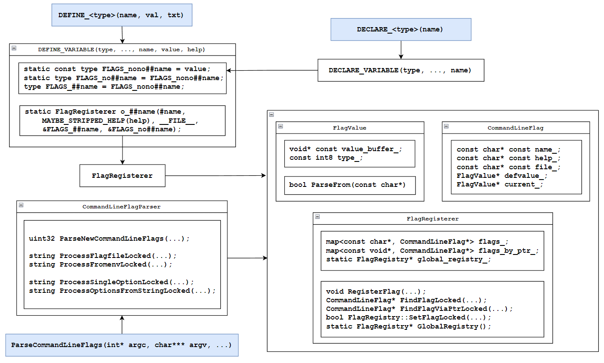
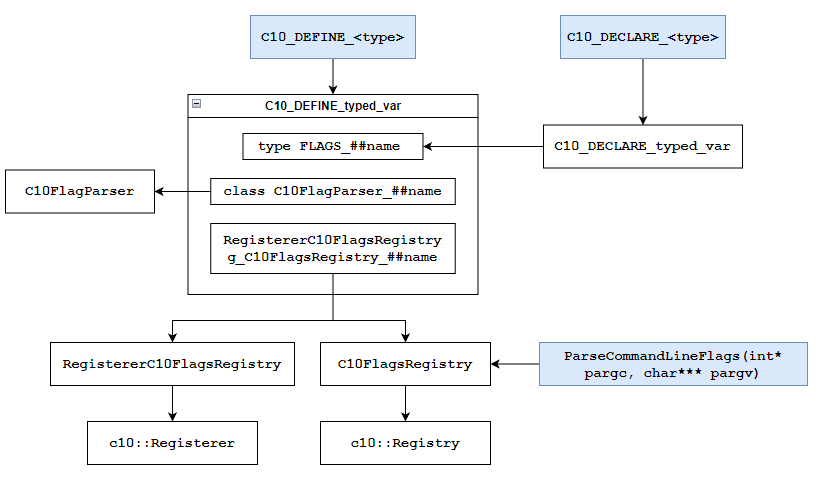

## 实现 Paddle flags 机制

| 版本 | 作者      | 时间      |
| ---- | --------- | -------- |
| V1.0 | huangjiyi | 2023.7.23 |

## 一、概要

### 1. 相关背景

目前 Paddle 已基本完成 PHI 算子库的独立编译 ([PR#53735](https://github.com/PaddlePaddle/Paddle/pull/53735))，在实现这个目标的过程中出现过一个问题：phi 中用到 gflags 第三方库的 Flag 定义宏在 phi 编译成动态链接库后无法在 windows 上暴露 Flag 符号，当时的做法是在 phi 下重写 Flag 定义宏 (底层仍然依赖 gflags 第三方库)，使其能够在 windows 上暴露 Flag 符号 ([PR#52991](https://github.com/PaddlePaddle/Paddle/pull/52991))

但是目前还存在 gflags 第三方库相关的另外一个问题：由于 Paddle 依然依赖了 gflags 库，外部用户同时使用 paddle C++ 库和 gflags 库时，会出现以下错误：

``` bash
ERROR: something wrong with flag 'flagfile' in file '/Paddle/third_party/gflags/src/gflags.cc'.  One possibility: file '/Paddle/third_party/gflags/src/gflags.cc' is being linked both statically and dynamically into this executable.
```

这个错误是因为在 gflags 的源文件 `gflags.cc` 中，会注册一些 Flag，比如 `flagfile`：

``` C++
DEFINE_string(flagfile,   "", "load flags from file");
```

因为 Paddle 依赖了 gflags，所以 `libpaddle.so` 中也会注册 `flagfile`，然后外部用户如果再依赖 gflags，会重复注册 `flagfile` 导致报错，`gflags.cc` 中的报错相关代码：

``` C++
void FlagRegistry::RegisterFlag(CommandLineFlag* flag) {
  Lock();
  pair<FlagIterator, bool> ins =
    flags_.insert(pair<const char*, CommandLineFlag*>(flag->name(), flag));
  if (ins.second == false) {   // means the name was already in the map
    if (strcmp(ins.first->second->filename(), flag->filename()) != 0) {
      ReportError(DIE, "ERROR: flag '%s' was defined more than once "
                  "(in files '%s' and '%s').\n",
                  flag->name(),
                  ins.first->second->filename(),
                  flag->filename());
    } else {
      ReportError(DIE, "ERROR: something wrong with flag '%s' in file '%s'.  "
                  "One possibility: file '%s' is being linked both statically "
                  "and dynamically into this executable.\n",
                  flag->name(),
                  flag->filename(), flag->filename());
    }
  }
  // Also add to the flags_by_ptr_ map.
  flags_by_ptr_[flag->current_->value_buffer_] = flag;
  Unlock();
}
```

为了解决上述问题，计划移除 Paddle 对 gflags 第三方库的依赖，在 Paddle 下实现一套独立的 flags 相关机制。

### 2. 功能目标

在 Paddle 下实现一套独立的 flags 相关机制，包括：

- 多种类型（bool, int32, uint32, int64, uint64, double, string）的 Flag 定义和声明宏
- 命令行参数解析，即根据命令行参数对已定义的 Flag 的 value 进行更新
- 其他 Paddle 用到的 Flag 相关操作
- 待后续补充 ...

细节要求：新实现的 flags 相关机制提供的接口与现有的接口尽可能保持一致，从而降低替换成本

待后续 Paddle 下独立的 flags 相关机制初步实现完善后，暂时将 Paddle 现有的依赖第三方库的 flags 机制保留，实现能够通过编译选项以及宏控制，选择使用哪个版本 flags 机制（需要两个版本的接口一致）

### 3. 意义

完善 Paddle 下的 flags 机制，提高框架开发者开发体验以及用户使用体验

## 二、飞桨现状

Paddle 目前在 `paddle/phi/core/flags.h` 中对 gflags 中的 Flag 注册宏 `DEFINE_<type>` 和声明宏 `DEFINE_<type>` 进行了重写，重写的代码和 gflags 的实现基本一致，只是修改了一些接口名字和命名空间，同时添加了支持 Windows 下的 Flag 符号暴露，但 Paddle 目前的 Flag 注册宏和声明宏底层依然依赖的是 gflags 的代码

### Paddle 中现有的 flags 用法

在 Paddle 中现有的 flags 用法主要是 Flag 注册和声明宏，以及一些 gflags 的接口：

1. flags 机制中使用的接口是 Flag 注册和声明宏：`(PHI_)?(DEFINE|DECLARE)_<type>`，Paddle 最多的用法：
   - `DEFINE_<type>(name,val, txt)` 用于定义目标类型的 FLAG，相当于定义一个全局变量 `FLAGS_name`，约 200+ 处用法
   - `DECLARE_<type>(name)` 用于声明 FLAG，相当于 `extern` 用法，约 300+ 处用法
2. `gflags::ParseCommandLineFlags(int* argc, char*** argv, bool remove_flags)`：用于解析运行时命令行输入的标志，大部分在测试文件中使用，约 20+ 处用法
3. `gflags::(GetCommandLineOption|SetCommandLineOption|AllowCommandLineReparsing|<Type>FromEnv)`：其他一些用法较少的 gflags 接口：
   - `bool GetCommandLineOption(const char* name, std::string* OUTPUT)`：用于获取 FLAG 的值，1 处用法
   - `std::string SetCommandLineOption (const char* name, const char* value)`：将 `value` 赋值给 `FLAGS_name`，2 处用法
   - `void AllowCommandLineReparsing()`：允许命令行重新解析，1 处用法

## 三、业内方案调研

### gflags

ref: https://github.com/gflags/gflags



- `DEFINE_<type>(name, val, txt)`：除 string 类型外，`DEFINE_<type>` 底层均调用 `DEFINE_VARIABLE`

- `DECLARE_<type>(name)`：统一调用 `DECLARE_VARIABLE`，实现就是简单的 `extern` 用法

- `DEFINE_VARIABLE`：关键 Flag 定义宏

  ``` C++
  #define DEFINE_VARIABLE(type, shorttype, name, value, help)             \
    namespace fL##shorttype {                                             \
      static const type FLAGS_nono##name = value;                         \
      /* We always want to export defined variables, dll or no */         \
      GFLAGS_DLL_DEFINE_FLAG type FLAGS_##name = FLAGS_nono##name;        \
      static type FLAGS_no##name = FLAGS_nono##name;                      \
      static GFLAGS_NAMESPACE::FlagRegisterer o_##name(                   \
        #name, MAYBE_STRIPPED_HELP(help), __FILE__,                       \
        &FLAGS_##name, &FLAGS_no##name);                                  \
    }                                                                     \
    using fL##shorttype::FLAGS_##name
  ```

  `DEFINE_VARIABLE` 中定义了 3 个变量：

  - `FLAGS_##name`：全局变量，表示 Flag 当前值
  - `FLAGS_no##name`：静态全局变量，表示 Flag 默认值
  - `FLAGS_nono##name`：静态常量，只用来给 `FLAGS_##name` 和 `FLAGS_no##name` 赋值

  > 这里 gflags 的解释是：当 `value` 是一个编译时常量时，`FLAGS_nono##name` 能够在编译时确定，这样能够确保 `FLAGS_##name` 进行静态初始化（程序启动前），而不是动态初始化（程序启动后，但在 `main` 函数之前）；另外变量名称有含有 `no` 是为了避免同时定义 `name` 和 `no##name` 标志，因为 gflags 支持在命令行使用 `--no<name>` 设置 `FLAGS_name`  为 `false`
  >
  > PS：我觉得这里有点问题：只要 `value` 是编译时常量，使用 `value` 赋值同样能够确保 `FLAGS_##name` 在静态初始化阶段进行初始化，而且只有 `FLAGS_##name` 和 `FLAGS_no##name` 就可以避免同时定义 `name` 和 `no##name` 标志了，所以完全不需要一个额外的 `FLAGS_nono##name`
  >
  > ref: https://en.cppreference.com/w/cpp/language/initialization
  >
  > 另外 `DEFINE_string` 进行了额外的实现，gflags 的解释是 std::string 不是 POD (Plain Old Data) 类型，只能进行动态初始化而不能进行静态初始化，为了尽量避免在这种情况下出现崩溃，gflags 先用 char buffer 来存放字符串，使其能够进行静态初始化，后续再使用 placement-new 构建 std::string
  >
  > PS：这里有点疑惑：都是在程序启动之前进行初始化，为什么动态初始化可能会出问题，难不成可能在动态初始化之前就需要访问 Flag 吗？
  >
  > 感觉 gflags 关于初始化的这部分有些过度设计了，或者是因为这部分代码看记录是十几年前写的，那时候还没出 C++11.

- `FlagRegisterer`：`DEFINE_VARIABLE` 最后会构造一个 `FlagRegisterer` 对象，`FlagRegisterer` 的构造函数的具体实现是在 Flag 注册表中注册输入的 Flag

- `FlagValue`：存放标志数据指针和类型，以及一些相关操作，比较重要的是 `ParseFrom`，将字符串 value 转化为对应 type 的 value

- `CommandLineFlag`：存放一个命令行标志的所有信息，包括 name, description, default_value 和  current_value，其中 value 用 `FlagValue` 表示

- `FlagRegistry`：Flag 注册表，用于管理所有通过 `DEFINE_<type>` 定义的 Flag

  关键成员变量：

  - `flags`：key 为 name，value 为 flag 的查找表
  - `flags_by_ptr_`：key 为数据指针（即 `&FLAGS_##name`），value 为 flag 的查找表
  - `global_registry_`：注册表全局单例

  关键成员函数：

  - `void RegisterFlag(CommandLineFlag* flag)`：注册 flag
  - `CommandLineFlag* FindFlagLocked(const char* name)`：通过 name 查找 flag
  - `CommandLineFlag* FindFlagViaPtrLocked(const void* flag_ptr)`：通过数据指针查找 flag
  - `bool FlagRegistry::SetFlagLocked(CommandLineFlag* flag,const char* value)`：设置输入 flag 的 value

  静态函数：`static FlagRegistry* GlobalRegistry()`：获取注册表全局单例

- `ParseCommandLineFlags(int* argc, char*** argv, ...)`：命令行标志解析函数，具体功能是对命令行运行程序时输入的标志进行解析并更新 Flag 的值，解析的逻辑主要通过 `CommandLineFlagParser` 类实现

- `CommandLineFlagParser`：命令行标志解析实现类，关键就是实现的几个函数：

  - `ParseNewCommandLineFlags(int* argc, char*** argv, ...)`：命令行标志解析实现，具体就是从命令行输入中提取标志的 name 和 value，再调用 `FlagRegistry` 设置 value
  - `ProcessFlagfileLocked(const string& flagval, ...)`：如果命令行中存在 `--flagfile <file_path>` 或者再调用 `ParseCommandLineFlags` 之前设置了 `FLAGS_flagfile` 的值，那么就可以从提供的 flagfile 中读取一系列 flag
  - `ProcessFromenvLocked(const string& flagval, ...)`：同 `flagfile`，如果设置了 `--fromenv`，`--tryfromenv` 或者 `FLAGS_fromenv`，`FLAGS_tryfromenv`（value 为以 `,` 分割的环境变量），那么就可以将环境变量的值赋给对应的 Flag
  - `ProcessSingleOptionLocked(CommandLineFlag* flag, const char* value, ...)`：解析完参数后调用该函数进行设置，具体实现是调用 `GlobalRegistry()->SetFlagLocked(flag, value)` 更新 flag，但是如果 flag name 为 `flagfile`, `fromenv`, `tryfromenv` 时，会调用 `ProcessFlagfileLocked` 或者 `ProcessFromenvLocked`
  - `ProcessOptionsFromStringLocked(const string& content, ...)`：`ProcessFlagfileLocked` 的下层实现，输入 `content` 是文件的内容，具体实现是一行行读取并解析 Flag

### Pytorch

ref: https://github.com/pytorch/pytorch

Pytorch 可以选择是否使用基于 `gflags` 库实现的 `Flags` 工具，具体实现方式是设置了一个编译选项以及对应的宏，默认不适用 gflags：

``` cmake
option(USE_GFLAGS "Use GFLAGS" OFF)
set(C10_USE_GFLAGS ${USE_GFLAGS})
```

实现文件：

- `c10/util/Flags.h`：定义 flags 接口
- `c10/util/flags_use_gflags.cpp`：使用 gflags 第三方库实现接口（简单的封装）
- `c10/util/flags_use_no_gflags.cpp`：不使用 gflags 的实现版本

具体实现：



- `C10_DEFINE_<type>`：用于定义特定类型的标志，统一调用 `C10_DEFINE_typed_var` 宏

- `C10_DEFINE_typed_var`：最关键的一个宏，用于定义和注册 Flag

  ``` C++
  #define C10_DEFINE_typed_var(type, name, default_value, help_str)       \
    C10_EXPORT type FLAGS_##name = default_value;                         \
    namespace c10 {                                                       \
    namespace {                                                           \
    class C10FlagParser_##name : public C10FlagParser {                   \
     public:                                                              \
      explicit C10FlagParser_##name(const std::string& content) {         \
        success_ = C10FlagParser::Parse<type>(content, &FLAGS_##name);    \
      }                                                                   \
    };                                                                    \
    }                                                                     \
    RegistererC10FlagsRegistry g_C10FlagsRegistry_##name(                 \
        #name,                                                            \
        C10FlagsRegistry(),                                               \
        RegistererC10FlagsRegistry::DefaultCreator<C10FlagParser_##name>, \
        "(" #type ", default " #default_value ") " help_str);             \
    }
  ```

  - 首先定义全局变量 `FLAGS_##name`，用于存放 Flag 的值，也用于 Flag 的访问

  - 然后定义了一个 `C10FlagParser_##name` 类，其构造函数会调用 `C10FlagParser::Parse`，这个函数的功能是将输入的 `content` 字符串解析成对应 type 的值，然后赋值给 `FLAGS_##name`

  - 最后构造了一个 `RegistererC10FlagsRegistry` 类型的注册器对象 `g_C10FlagsRegistry_##name`，这个注册器对象的构造过程就是在注册表 `C10FlagsRegistry()` 中注册一个 `(key, creater)` 项，其中 `key` 为 `#name`，`creater` 是 ` RegistererC10FlagsRegistry::DefaultCreator<C10FlagParser_##name>` 函数，具体实现就是构造一个 `C10FlagParser_##name` 对象，相当于给 `FLAGS_##nam` 赋值

  - `C10FlagsRegistry()`：用于获取 Flag 注册表单例，通过通用注册表 `c10::Registry` 构造得到，该注册表中每一项是一个 `(key, creater)` 对，其中 `key` 类型为 `std::string`，`creater` 类型为返回值为 `std::unique_ptr<C10FlagParser>`，输入为 `const string&` 的函数

    ``` C++
    C10_EXPORT ::c10::Registry<std::string, std::unique_ptr<C10FlagParser>, const string&>*
        C10FlagsRegistry() {
        static ::c10::Registry<std::string, std::unique_ptr<C10FlagParser>, const string&>*
            registry = new ::c10::
                Registry<std::string, std::unique_ptr<C10FlagParser>, const string&>();
        return registry;
      }
    ```

  - `RegistererC10FlagsRegistry`：Flag 注册器类型，由通用注册器类型 `c10::Registerer` 具体化得到，其中模板参数与 `C10FlagsRegistry` 具体化 `c10::Registry` 的模板参数对应，该注册器的功能就是你构造一个注册器对象，就会在指定的注册表中注册一个 Flag，代码见 `c10/util/Registry.h` 中的 `class Registerer`

    ``` C++
    typedef ::c10::Registerer<std::string, std::unique_ptr<C10FlagParser>, const std::string&> RegistererC10FlagsRegistry;
    ```

  - 综上，一个 Flag 的定义过程就是：定义 Flag 全局变量 (`FLAGS_##name`)，定义 Flag 赋值函数 (`C10FlagParser_##name` 的构造函数)，通过构造一个注册器对象在 Flag 注册表中注册 `key` 为 `#name`，`creater` 为 Flag 赋值函数的 `(key, creater)` 项，如果需要重新设置 `Flag_##name` 的值可以调用 key `#name` 对应的 `creater`

- `C10_DECLARE_<type>`：用于声明指定 Flag，统一调用 `C10_DECLARE_typed_var` 实现，底层就是一个 `extern` 用法：

  ``` C++
  #define C10_DECLARE_typed_var(type, name) C10_API extern type FLAGS_##name
  ```

- `ParseCommandLineFlags(int* pargc, char*** pargv)`：解析命令行参数，代码主要就是解析命令行参数的一些逻辑，这部分可以看 `c10/util/flags_use_no_gflags.cpp` 中的代码，在每个命令行参数被解析完后，会在通过 `C10FlagsRegistry()->Create(key, value)` 给注册表中对应的 Flag 赋值。

### 对比分析

**gflags** 

- 优点：提供的功能很多，同时各方面都考虑的很完善

- 缺点：很多功能 Paddle 不太需要，并且一些代码实现有些过度设计的感觉，整体代码比较复杂

**pytorch**

- 优点：整体实现比较简洁，方便理解，同时设计比较巧妙：pytorch 没有设计 Flag 数据结构，只针对每个 Flag 设计了对应的赋值函数，然后在注册表中只存放 name, help_string, 赋值函数

- 缺点：只实现了最主要的功能，同时不方便扩展

## 四、设计思路与实现方案

